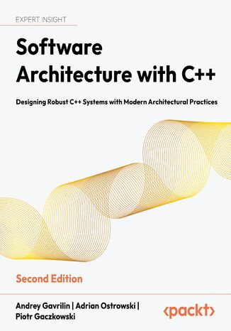

# Software Architecture with C++, Second Edition

Software Architecture with C++: Designing Robust C++ Systems with Modern Architectural Practices, Second Edition, published by Packt

<a href="https://www.packtpub.com/en-us/product/software-architecture-with-c-9781803243016">
  
</a>

**Architect high-quality C++ applications using modern features and patterns, with expanded coverage of observability
and cloud-native tooling, plus new content on monadic design techniques for modular C++ development.**

### Key features

- Architect high-performance C++ systems using C++20 and beyond
- Build, test, and secure production-ready systems by applying solid design principles
- Manage, package, and deploy cloud-native applications using CMake, Conan, and CI/CD

### Book description

Designing scalable and maintainable software with C++ requires more than language expertise—it demands architectural thinking
and an ability to deliver systems in dynamic environments. This practical guide equips you with the architectural skills
needed to design and build robust, distributed software systems using modern C++.

Starting with fundamental architectural principles and design philosophies, the book walks readers through practical approaches
to designing and deploying reliable systems. This edition includes significant updates and new content: chapters on observability,
package management, and C++ modules address real-world software challenges. Readers will explore software decomposition strategies,
design and system patterns, fault tolerance, API management, and testability—all applied with C++.

Additionally, the book covers modern CI/CD pipelines, cloud-native design, microservices, and modular development,
helping developers navigate today's fast-evolving software landscape. With updated examples and a renewed emphasis
on maintainable and observable architectures, this edition equips C++ professionals to architect modern, production-grade systems.
By the end of this book, you will be able to design, build, test, and deploy enterprise-grade software solutions using
modern C++ and proven architectural techniques.

### What you will learn

- Apply architectural fundamentals to design scalable C++ systems
- Use modern C++ features to create maintainable and secure applications
- Implement architectural and system design patterns
- Design testable code and automate quality checks via CI/CD pipelines
- Manage dependencies and build systems using CMake and Conan
- Explore microservices, containers, and cloud-native practices in C++
- Improve observability with logging, tracing, and monitoring tools
- Build secure, fault-tolerant, and high-performance production-grade software

### Who this book is for

This book is intended for experienced C++ developers and software engineers aiming to expand their architectural knowledge,
lead software projects, or build scalable systems. It assumes readers are comfortable with modern C++ (C++11 onwards)
and familiar with basic design principles and patterns.

<a href="https://www.packtpub.com/">
  
</a>

### Table of contents

**Part 1: Concepts and Components of Software Architecture**

Chapter 1: [Importance of Software Architecture and Principles of Great Design](Chapter01)

Chapter 2: [Architectural Styles](Chapter02)

Chapter 3: [Functional and Nonfunctional Requirements](Chapter03)

**Part 2: The Design and Development of C++ Software**

Chapter 4: [Architectural and System Design Patterns](Chapter04)

Chapter 5: [Leveraging C++ Language Features](Chapter05)

Chapter 6: [Design Patterns and C++ Idioms](Chapter06)

Chapter 7: [Building and Packaging](Chapter07)

Chapter 8: [Package Management](Chapter08)

Chapter 9: [The Future of C++ Code Reuse: Using Modules](Chapter09)

**Part 3: Developing Quality Software**

Chapter 10: [Writing Testable Code](Chapter10)

Chapter 11: [Continuous Integration and Continuous Deployment](Chapter11)

Chapter 12: [Security in Code and Deployment](Chapter12)

Chapter 13: [Performance](Chapter13)

**Part 4: Cloud Native design and distributed systems**

Chapter 14: [Architecture of Distributed Systems](Chapter14)

Chapter 15: [Interservice communication](Chapter15)

Chapter 16: [Containers](Chapter16)

Chapter 17: [Observability](Chapter17)

Chapter 18: [Cloud Native Design](Chapter18)

### Development environment

Follow these guides to configure the development environment:

- [ Linux environment](devenv_readme/devenv_linux.md)
- [ macOS environment](devenv_readme/devenv_macos.md)
- [ Windows environment](devenv_readme/devenv_windows.md)

### C++ compilers

You need at least one of the following compilers:

| No. | Software required    | OS required                        |
| --- | -------------------- | ---------------------------------- |
| 1   | GCC 15               | Windows, Mac OS X, and Linux (Any) |
| 2   | Clang 20             | Windows, Mac OS X, and Linux (Any) |
| 3   | MSVC 19.50 (VS 2026) | Windows                            |

The examples are compatible with earlier versions of C++ compilers (GCC 14, Clang 19 and MSVC 19.44), but not all of them.

We also provide a [PDF file](https://packt.link/gbp/9781803243016) that has color images of the screenshots/diagrams used in this book.

### Instructions and navigations

All the code is organized into folders. For example, Chapter02.

The code will look like the following:

```
  int count = 0;
  for (std::size_t i = 0; i < len; ++i) {
    if (str[i] == '.') count++;
  }
```

### Get to know the authors

**[Adrian Ostrowski](https://aostrowski.github.io/)** [](https://www.linkedin.com/in/adr-ostrowski/)
is a modern C++ enthusiast interested in the development of both the C++ language itself and the high-quality code written in it.
A lifelong learner with over a decade of experience in the IT industry and more than 8 years of experience with C++ specifically,
he's always eager to share his knowledge. His past projects range from parallel computing, through fiber networking,
to working on a commodity exchange's trading system. Currently, he's one of the architects of Intel and Habana's integration with machine learning frameworks.
In his spare time, Adrian used to promote music bands together with Piotr and has learned how to fly a glider.
Currently, he likes riding his bicycle, going to music events, and browsing memes.

**[Piotr Gaczkowski](https://doomhammer.info)** [](https://www.linkedin.com/in/piotrgaczkowski/)
has more than 10 years of experience in programming and practicing DevOps and uses his skills to improve people's lives.
He likes building simple solutions to human problems, organizing cultural events, and teaching fellow professionals.
Piotr is keen on automating boring activities and using his experience to share knowledge by conducting courses and writing articles about personal growth and remote work.
He has worked in the IT industry both in full-time positions and as a freelancer, but his true passion is music.
When not making his skills useful at work, you can find him building communities.

**[Andrey Gavrilin](https://gav2xlin.my.canva.site/)** [](https://www.linkedin.com/in/gav2xlin/)
is a seasoned software engineer who started his journey into software development many years ago. His career began with an eagerness for computer games,
which led to learning C++, Pascal and the assembly language. He has an MSc degree in engineering (industrial automation) and
has worked in different areas which allowed him to gain comprehension of the importance of quality software architecture.
His interests include system, embedded and game programming, electronics. Being an enthusiast of retro gaming and vintage computing,
he enjoys exploring how historical technologies inform modern system design. These hobbies complement his professional work,
providing creative inspiration and perspective on the IT evolution.

If you feel this book is for you, get your copy today!

ISBN: [978-1-80324-301-6](https://nicebooks.com/us/search/isbn?isbn=9781803243016)

In book stores:

- [ **Packt (com)**](https://www.packtpub.com/en-us/product/software-architecture-with-c-9781803243016)

- [ **Amazon (com)**](https://www.amazon.com/Software-Architecture-Designing-Architectural-Practices/dp/1803243015/)

- [ **AbeBooks (com)**](https://www.abebooks.com/9781803243016/Software-Architecture-Designing-robust-systems-1803243015/plp)

- [ **Academicbooks.dk (dk)**](https://www.academicbooks.dk/content/software-architecture-c-1)

- [ **Accuris (com)**](https://store.accuristech.com/standards/software-architecture-with-c-second-edition?product_id=3043703)

- [ **Adlibris (com)**](https://www.adlibris.com/sv/bok/software-architecture-with-c-9781803243016)

- [ **Agapea.com (com)**](https://www.agapea.com/libros/Software-Architecture-with-C-Second-Edition-9781803243016-i.htm)

- [ **Akademibokhandeln (se)**](https://www.akademibokhandeln.se/bok/software-architecture-with-c/9781803243016)

- [ **Alibris (com)**](https://www.alibris.com/Software-Architecture-with-C-Designing-Robust-C-Systems-with-Modern-Architectural-Practices-Andrey-Gavrilin/book/56621941)

- [ **Angus & Robertson (com.au)**](https://www.angusrobertson.com.au/books/software-architecture-with-c-andrey-gavrilin-adrian-ostrowski-piotr-gaczkowski/p/9781803243016)

- [ **Apple Books (com)**](https://books.apple.com/us/book/software-architecture-with-c/id6757083961)

- [ **Barnes & Noble (com)**](https://www.barnesandnoble.com/w/software-architecture-with-c-andrey-gavrilin/1147771333)

- [ **Beam e-Books (de)**](https://www.beam-shop.de/belletristik/fremdsprachige-romane/1194826/software-architecture-with-c)

- [ **Bestseller.si (si)**](https://www.bestseller.si/knjiga/9781803243016/software-architecture-with-c)

- [ **Better World Books (com)**](https://www.betterworldbooks.com/product/detail/software-architecture-with-c-designing-robust-c-systems-with-modern-architectural-practices-9781803243016)

- [ **Biblio (com)**](https://www.biblio.com/9781803243016)

- [ **Blackwell's (co.uk)**](https://blackwells.co.uk/bookshop/product/Software-Architecture-With-C-by-Andrey-Gavrilin-Adrian-Ostrowski-Piotr-Gaczkowski/9781803243016)

- [ **Bokus (com)**](https://www.bokus.com/bok/9781803243016/software-architecture-with-c/)

- [ **Bol (com)**](https://www.bol.com/nl/fr/p/software-architecture-with-c/9300000235129507/)

- [ **Bookmall (co.za)**](https://www.bookmall.co.za/Software-Architecture-with-C-Designing-robust-C-systems-with-modern-architectural-practices-ap-1803243015.html)

- [ **Books etc. (co.uk)**](https://www.booksetc.co.uk/books/view/-9781803243016)

- [ **Books-A-Million (com)**](https://www.booksamillion.com/product/1803243015)

- [ **Bookscape (com)**](https://bookscape.com/product-details/software-architecture-with-c-second-edition-9781803243016)

- [ **BookScouter (com)**](https://bookscouter.com/book/9781803243016-software-architecture-with-c-designing-robust-c-systems-with)

- [ **Bookshop.org (org)**](https://bookshop.org/p/books/software-architecture-with-c-second-edition-designing-robust-c-systems-with-modern-architectural-practices-adrian-ostrowski/f044411d2201c8ab)

- [ **Bookstores.com (com)**](https://www.bookstores.com/books/software-architecture-with-c-andrey-gavrilin/9781803243016)

- [ **Booktopia (com.au)**](https://www.booktopia.com.au/software-architecture-with-c-second-edition-andrey-gavrilin/book/9781803243016.html)

- [ **Browns Books (co.uk)**](https://www.brownsbfs.co.uk/Product/Gavrilin-Andrey/Software-Architecture-with-C/9781803243016)

- [ **Buffalo Street Books (com)**](https://buffalostreetbooks.com/book/9781803243016)

- [ **Bücher.de (de)**](https://www.buecher.de/artikel/ebook/software-architecture-with-c-ebook-epub/76236833)

- [ **CampusBooks.com (com)**](https://www.campusbooks.com/books/9781803235059-software-architecture-with-c)

- [ **Cellar Door Bookstore (com)**](https://cellardoorbookstore.com/book/9781803243016)

- [ **Chasse aux Livres (fr)**](https://www.chasse-aux-livres.fr/prix/1803243015/software-architecture-with-c-andrey-gavrilin)

- [ **Direct Textbook (com)**](https://www.directtextbook.com/isbn/9781803243016-software-architecture-with-c-designing-robust-c-systems-with-modern-architectural-practices)

- [ **Dymocks (com.au)**](https://www.dymocks.com.au/software-architecture-with-c-second-edition-by-andrey-gavrilin-and-adrian-ostrowski-9781803243016)

- [ **Easy Learning (in)**](https://easylearningdvds.in/product/software-architecture-principles-and-best-practices-using-c/)

- [ **Ebookpoint (pl)**](https://ebookpoint.pl/ksiazki/software-architecture-with-c-designing-robust-c-systems-with-modern-architectural-practices-s-andrey-gavrilin-adrian-ostrowski-piotr-gaczkowsk,e_4ikt.htm)

- [ **eBooks.com (com)**](https://www.ebooks.com/book/346725460/software-architecture-with-c/andrey-gavrilin/)

- [ **Eichendorff21 (de)**](https://eichendorff21.de/buch/9781803243016/)

- [ **Enbook (cz)**](https://www.enbook.cz/cs/kniha/software-architecture-with-c-second-edition_50252706)

- [ **Enbook (pl)**](https://www.enbook.pl/pl/ksiazka/software-architecture-with-c-second-edition_50252706)

- [ **Eurobooks (sk)**](https://www.eurobooks.sk/en/software-architecture-with-c-second-edition)

- [ **Ex Libris (ch)**](https://www.exlibris.ch/de/buecher-buch/englische-ebooks/andrey-gavrilin/software-architecture-with-c/id/9781803235059)

- [ **Exclusive Books (co.za)**](https://exclusivebooks.co.za/products/9781803243016)

- [ **Expert Training (com)**](https://expertrainingdownload.com/product/software-architecture-principles-and-best-practices-using-c/)

- [ **Faghaat Ketab (ir)**](https://faghatketab.ir/product/software-architecture-with-cpp/)

- [ **Feltrinelli (it)**](https://www.lafeltrinelli.it/software-architecture-with-c-designing-libro-inglese-vari/e/9781803243016)

- [ **Fishpond (com)**](https://www.fishpond.com/Books/Software-Architecture-with-C-Second-Edition-Andrey-Gavrilin-Adrian-Ostrowski/9781803243016)

- [ **Fnac (com)**](https://www.fnac.com/livre-numerique/a21817433/Andrey-Gavrilin-Software-Architecture-with-C)

- [ **Foyles (co.uk)**](https://www.foyles.co.uk/book/software-architecture-with-c/andrey-gavrilin/9781803243016)

- [ **GetTextbooks.com (com)**](https://www.gettextbooks.com/isbn/9781803243016/)

- [ **Google Books (com)**](https://play.google.com/store/books/details/Andrey_Gavrilin_Software_Architecture_with_C?id=DkihEQAAQBAJ)

- [ **Harvard Book Store (com)**](https://www.harvard.com/book/9781803243016)

- [ **Helion (pl)**](https://helion.pl/ksiazki/software-architecture-with-c-designing-robust-c-systems-with-modern-architectural-practices-s-andrey-gavrilin-adrian-ostrowski-piotr-gaczkowsk,e_4ikt.htm)

- [ **Hugendubel (de)**](https://www.hugendubel.de/de/taschenbuch/andrey_gavrilin_adrian_ostrowski_piotr_gaczkowski-software_architecture_with_c_second_edition-52343878-produkt-details.html)

- [ **IberLibro.com (com)**](https://www.iberlibro.com/9781803243016/Software-Architecture-Designing-Robust-Systems-1803243015/plp)

- [ **Indigo (ca)**](https://www.indigo.ca/en-ca/software-architecture-with-c-designing-robust-c-systems-with-modern-architectural-practices/4f642cc1-2e6c-3599-a59a-49667b0d7be4.html)

- [ **Kinokuniya (com)**](https://united-states.kinokuniya.com/bw/9781803243016)

- [ **Kogan.com (com)**](https://www.kogan.com/au/buy/the-nile-software-architecture-with-c-9781803243016/)

- [ **Krainaksiazek (pl)**](https://krainaksiazek.pl/Software-Architecture-with-C---Second-Edition-Designing-robust-C-systems-with-modern-architectural-practices,9781803243016.html)

- [ **Krisostomus (ee)**](https://www.kriso.ee/software-architecture-cplusplus-designing-robust-cplusplus-db-9781803243016.html)

- [ **Kyobo (co.kr)**](https://product.kyobobook.co.kr/detail/S000218930778)

- [ **Lehmanns Media (de)**](https://www.lehmanns.de/shop/naturwissenschaften/80646854-9781803243016-software-architecture-with-cplusplus)

- [ **Libreria IBS (it)**](https://www.ibs.it/software-architecture-with-c-designing-libro-inglese-vari/e/9781803243016)

- [ **Libristo (pl)**](https://www.libristo.pl/pl/ksiazka/software-architecture-with-c-second-edition_50252706)

- [ **Magazyn (pl)**](https://helion.magazyn.pl/Software-Architecture-with-C-Designing-Robust-C-Systems-with-Modern-Architectura/e_4ikt_ebook/ksiazka.html)

- [ **Manz Webshop (at)**](https://shop.manz.at/shop/products/9781803243016)

- [ **Medimops** (de)](https://www.medimops.de/andrey-gavrilin-software-architecture-with-c-designing-robust-c-systems-with-modern-architectural-practices-paperback-M01803243015.html)

- [ **Mofibo (com)**](https://mofibo.com/dk/books/software-architecture-with-c-designing-robust-c-systems-with-modern-architectural-practices-13244520)

- [ **Momox shop (fr)**](https://www.momox-shop.fr/andrey-gavrilin-software-architecture-with-c-designing-robust-c-systems-with-modern-architectural-practices-paperback-M01803243015.html)

- [ **Morawa.at (at)**](https://www.morawa.at/detail/ISBN-2244088350826/Gavrilin-Andrey/Software-Architecture-with-C)

- [ **Morgenweb eBooks (com)**](https://morgenweb.ciando-shop.com/ebook/bid-4304687-software-architecture-with-c--designing-robust-c-systems-with-modern-architectural-practices/)

- [ **Nextory (com)**](https://nextory.com/es/book/software-architecture-with-c-designing-robust-c-systems-with-modern-architectural-practices-5211839)

- [ **Northtown Books (com)**](https://www.northtownbooks.com/book/9781803243016)

- [ **O'Reilly (com)**](https://www.oreilly.com/library/view/software-architecture-with/9781803243016/)

- [ **Oblong Books (com)**](https://oblongbooks.com/book/9781803243016)

- [ **Orell Füssli (ch)**](https://www.orellfuessli.ch/shop/home/artikeldetails/A1077802198)

- [ **OverDrive (com)**](https://www.overdrive.com/media/12071203/software-architecture-with-c)

- [ **PChome Online (com.tw)**](https://24h.pchome.com.tw/books/prod/DJBQ3H-D900JI49W)

- [ **Pok'elai (com.tw)**](https://www.books.com.tw/products/F01b601515)

- [ **Prairie Lights (com)**](https://prairielights.com/book/9781803243016)

- [ **Preigu (de)**](https://preigu.de/buecher/software-architecture-with-c-second-edition/134408277)

- [ **Rakuten (co.jp)**](https://books.rakuten.co.jp/rk/4f642cc12e6c3599a59a49667b0d7be4/)

- [ **Rakuten Kobo (com)**](https://www.kobo.com/us/en/ebook/software-architecture-with-c-1)

- [ **Readings (com.au)**](https://www.readings.com.au/product/9781803243016/software-architecture-with-c--andrey-gavrilin-adrian-ostrowski-piotr-gaczkowski--2025--9781803243016)

- [ **Sandman Books (com)**](https://sandmanbooks.com/book/9781803243016)

- [ **Saxo (com)**](https://www.saxo.com/dk/software-architecture-with-c-second-edition_bog_9781803243016)

- [ **Schweitzer Fachinformationen (de)**](https://www.schweitzer-online.de/buch/Gavrilin/Software-Architecture-Cplusplus/9781803243016/A74541283/)

- [ **Skybook (ir)**](https://skybooks.ir/products/Software-Architecture-with-Cpp)

- [ **Stevens Books (com)**](https://computerscience.stevensbooks.com/products/software-architecture-with-c-second-edition-designing-robust-c-systems-with-modern-architectural-practices-9781803243016)

- [ **Storytel (com)**](https://www.storytel.com/books/software-architecture-with-c-designing-robust-c-systems-with-modern-architectural-practices-13244520)

- [ **Sundog Books (com)**](https://sundogbooks.com/book/9781803243016)

- [ **Tenlong (com.tw)**](https://www.tenlong.com.tw/products/9781803243016)

- [ **Tertulia (com)**](https://tertulia.com/book/software-architecture-with-c-----second-edition-designing-robust-c---systems-with-modern-architectural-practices-andrey-gavrilin/9781803243016)

- [ **TextbookX (com)**](https://www.textbookx.com/book/Software-Architecture-with-C/9781803243016/)

- [ **Thriftbooks (com)**](https://www.thriftbooks.com/w/software-architecture-with-c-designing-robust-c-systems-with-modern-architectural-practices_piotr-gaczkowski_adrian-ostrowski/57748300/#edition=74880207&idiq=87713972)

- [ **Valore (com)**](https://www.valore.com/products/software-architecture-with-c/9781803235059)

- [ **VitalSource (com)**](https://www.vitalsource.com/en-uk/products/software-architecture-with-c-andrey-gavrilin-v9781803235059)

- [ **Walmart (com)**](https://www.walmart.com/ip/Software-Architecture-with-C-Second-Edition-Designing-robust-C-systems-with-modern-architectural-practices-Paperback/19019502370)

- [ **Waterstones (com)**](https://www.waterstones.com/book/software-architecture-with-c/andrey-gavrilin/adrian-ostrowski/9781803243016)

- [ **World of Books (com)**](https://www.worldofbooks.com/en-gb/products/software-architecture-with-c-book-andrey-gavrilin-9781803243016)

- [ **Yes24 (com)**](https://www.yes24.com/product/goods/171440922)

- [ **Świat Czytników (pl)**](https://ebooki.swiatczytnikow.pl/ebook/9781803235059,andrey-gavrilin--adrian-ostrowski--piotr-gaczkowski--software-architecture-with-.html)

In libraries of engineering schools:

- [ **IEEE Xplore (org)**](https://ieeexplore.ieee.org/book/11321119)

- [ **Business-Vox (com)**](https://www.business-vox.com/catalog/book/docid/88977053)

- [ **MPG Books (de)**](https://ebooks.mpdl.mpg.de/ebooks/Record/EB002373639)

- [ **Princeton (edu)**](https://catalog.princeton.edu/catalog/99131714553706421)

- [ **ScholarVox (com)**](https://scholarvox.library.omneseducation.com/catalog/book/docid/88977053)

- [ **Skagit Valley College**](https://sbctc-skagit.primo.exlibrisgroup.com/permalink/01STATEWA_SKAGIT/1k7g980/alma991000858304102822)
